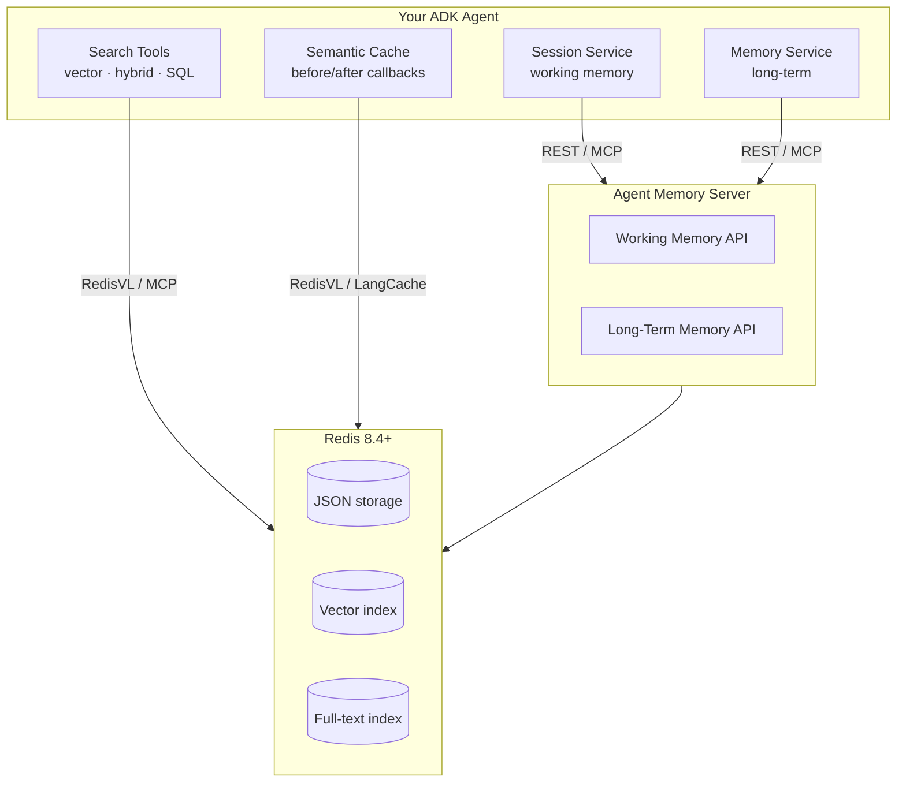

# ADK Overview

The [Google Agent Development Kit (ADK)](https://github.com/google/adk-python) is a framework for building AI agents with Google's Gemini models. `adk-redis` provides Redis-backed implementations of ADK's service interfaces so you can move from prototype to production without rewriting your agent.

## Architecture

## ADK Interfaces

`adk-redis` implements four ADK extension points. Each one maps to a concept page with full details.

| ADK Interface | `adk-redis` implementation | Concept page |
|---------------|---------------------------|-------------|
| `BaseSessionService` | `RedisWorkingMemorySessionService` | [Sessions + Memory Services](sessions.md) |
| `BaseMemoryService` | `RedisLongTermMemoryService` | [Sessions + Memory Services](sessions.md) |
| `BaseTool` | Search tools (`RedisVectorSearchTool`, `RedisHybridSearchTool`, etc.) and memory tools (`SearchMemoryTool`, `CreateMemoryTool`, etc.) | [Search Tools](search.md), [Memory MCP + Tools](memory.md) |
| Model callbacks | `LLMResponseCache` with `RedisVLCacheProvider` or `LangCacheProvider` | [Semantic Caching](caching.md) |

## Running Your Agent

ADK provides several ways to run and test agents:

- **`adk web`**: browser-based UI for interactive development and debugging.
- **`adk run`**: terminal-based interaction.
- **`adk api_server`**: RESTful API for production deployment.

See the [ADK runtime documentation](https://google.github.io/adk-docs/runtime/) for details.
