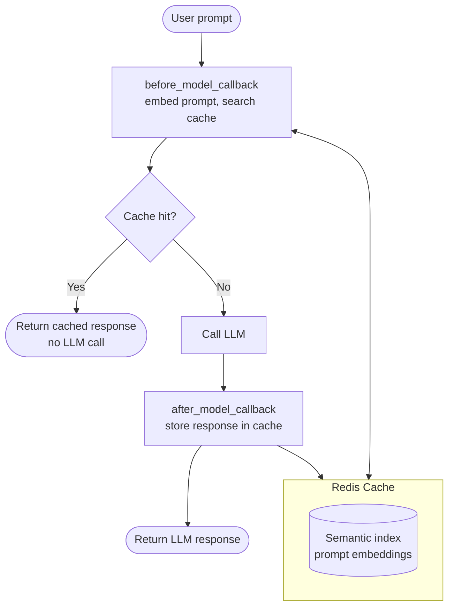

# Semantic Caching

`adk-redis` provides semantic caching that skips LLM calls when a user sends a prompt that is similar (or identical) to one already answered. This reduces latency and cost without changing agent behavior.

## Quick Reference

| Feature | Details |
|---------|---------|
| **What it caches** | LLM responses keyed by prompt similarity |
| **Similarity** | Vector distance between prompt embeddings |
| **Providers** | `RedisVLCacheProvider` (self-hosted) or `LangCacheProvider` (managed) |
| **TTL** | Configurable per-entry expiration |
| **Integration** | ADK `before_model_callback` / `after_model_callback` hooks |

## How It Works



1. Before the LLM is called, `LLMResponseCache` embeds the prompt and searches for a semantically similar entry in the cache.
2. If the distance is below the configured threshold, the cached response is returned immediately (no LLM call).
3. If no match is found, the LLM runs normally and the response is stored in the cache for future hits.

## Two Provider Options

### Self-Hosted (RedisVL)

Use `RedisVLCacheProvider` when you run your own Redis instance and want full control over the vectorizer and cache index.

```python
from redisvl.utils.vectorize import HFTextVectorizer

from adk_redis.cache import (
    LLMResponseCache,
    LLMResponseCacheConfig,
    RedisVLCacheProvider,
    RedisVLCacheProviderConfig,
)

vectorizer = HFTextVectorizer(model="redis/langcache-embed-v1")

provider = RedisVLCacheProvider(
    config=RedisVLCacheProviderConfig(
        redis_url="redis://localhost:6379",
        name="my_cache",
        ttl=3600,
        distance_threshold=0.1,
    ),
    vectorizer=vectorizer,
)
```

**Requirements**: `pip install 'adk-redis[search]'` and a running Redis instance.

### Managed (LangCache)

Use `LangCacheProvider` with [Redis LangCache](https://redis.io/langcache) for a fully managed service. No local vectorizer needed; embeddings are handled server-side.

```python
from adk_redis.cache import (
    LLMResponseCache,
    LLMResponseCacheConfig,
    LangCacheProvider,
    LangCacheProviderConfig,
)

provider = LangCacheProvider(
    config=LangCacheProviderConfig(
        cache_id="your-cache-id",
        api_key="your-api-key",
        server_url="https://aws-us-east-1.langcache.redis.io",
        ttl=3600,
    ),
)
```

**Requirements**: `pip install 'adk-redis[langcache]'` and a LangCache account.

## Wiring Into an Agent

Both providers use the same `LLMResponseCache` wrapper, which produces ADK-compatible callbacks:

```python
from adk_redis.cache import create_llm_cache_callbacks

llm_cache = LLMResponseCache(
    provider=provider,
    config=LLMResponseCacheConfig(
        first_message_only=True,   # only cache the first user message
        include_app_name=True,     # scope cache keys by app
        include_user_id=True,      # scope cache keys by user
    ),
)

before_cb, after_cb = create_llm_cache_callbacks(llm_cache)

agent = Agent(
    model="gemini-2.0-flash",
    name="my_agent",
    before_model_callback=before_cb,
    after_model_callback=after_cb,
)
```

## When to Use Which

| Provider | Use when |
|----------|----------|
| **RedisVL** | You already run Redis, want local embeddings, need full control over cache index schema. |
| **LangCache** | You want a managed service with no infrastructure, server-side embeddings, and built-in analytics. |

## Entry IDs and Targeted Invalidation

Both providers expose a stable identifier for each cache entry, so an application-level coordinator can retire exactly one stale entry without a semantic re-search and without clearing unrelated entries:

- `provider.check(prompt)` returns a `CacheEntry` whose `entry_id` field identifies the matched entry.
- `provider.store(prompt, response)` returns the identifier of the newly written entry.
- `provider.delete_by_id(entry_id)` deletes exactly that entry. Unlike `provider.clear()`, which removes every entry in the cache, `delete_by_id` targets a single entry.

```python
entry_id = await provider.store("What is our refund policy?", "30 days.")

hit = await provider.check("What's the refund policy?")
if hit is not None:
    print(hit.entry_id)  # same entry

# The source document changed; retire only this entry.
await provider.delete_by_id(entry_id)
```

ID availability per backend:

| Provider | `entry_id` value |
|----------|------------------|
| **LangCache** | The managed LangCache entry ID. |
| **RedisVL** | The RedisVL cache entry ID. |

For a given provider instance, identifiers returned by `check()` and `store()` are interchangeable inputs to `delete_by_id()`. `LLMResponseCache` does not use targeted invalidation itself; the simple read-through callback path is unchanged.

## Configuration Options

| Option | Provider | Default | Description |
|--------|----------|---------|-------------|
| `distance_threshold` | Both | `0.1` | Max vector distance for a cache hit (lower = stricter) |
| `ttl` | Both | `None` | Time-to-live in seconds for cache entries |
| `name` | RedisVL | `llmcache` | Redis index name for the cache |
| `redis_url` | RedisVL | `redis://localhost:6379` | Redis connection string |
| `cache_id` | LangCache | Required | LangCache instance identifier |
| `api_key` | LangCache | Required | LangCache API key |
| `use_exact_search` | LangCache | `True` | Enable exact (hash) matching in addition to semantic |
| `use_semantic_search` | LangCache | `True` | Enable semantic (vector) matching |

## Next Steps

- [Semantic cache example](https://github.com/redis-developer/adk-redis/tree/main/examples/semantic_cache) for a runnable self-hosted demo.
- [LangCache example](https://github.com/redis-developer/adk-redis/tree/main/examples/langcache_cache) for a runnable managed demo.
- [Sessions + Memory services](sessions.md) and [Sessions + Memory MCP](memory.md) for the other Redis-backed features.
- [ADK runtime options](https://google.github.io/adk-docs/runtime/) for `adk web`, `adk run`, and `adk api_server`.
