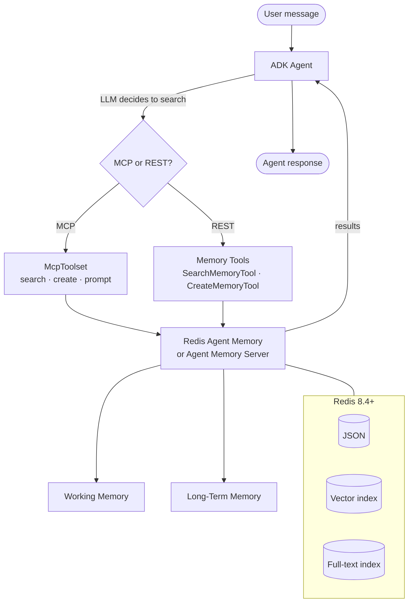

# Sessions + Memory with MCP + Tools

Use ADK's native `McpToolset` to connect your agent to the Agent Memory
Server's MCP endpoint, or use the Python memory tools directly. The Python
tools can target Redis Agent Memory or the self-hosted Agent Memory Server.
The LLM decides when to search, create, update, or delete memories.

## Quick Reference

| Feature | Details |
|---------|---------|
| **Protocol** | MCP (via SSE or Streamable HTTP) or REST-based ADK tools |
| **Control** | LLM-driven: the agent chooses when to remember and recall |
| **Session storage** | Redis Agent Memory or Agent Memory Server working memory |
| **Long-term memory** | Redis Agent Memory or Agent Memory Server with vector + full-text indexes |
| **Language support** | MCP works with Python, TypeScript, and any MCP-compatible client |

## How It Works



Unlike the [services approach](sessions.md), where the framework handles memory automatically, here the LLM explicitly calls memory tools during reasoning. This gives you fine-grained control over what gets stored and retrieved.

!!! note "MCP requires the self-hosted server"
    The SDK tools (Option 2) target either Redis Agent Memory
    (`redis-agent-memory`) or the self-hosted Agent Memory Server
    (`opensource-agent-memory`). The MCP path (Option 1) is provided only by the
    self-hosted Agent Memory Server; the managed backend has no MCP endpoint.

## Option 1: MCP Tools

Connect to the Agent Memory Server's MCP endpoint using ADK's `McpToolset`. This is the recommended approach for multi-language support and when the same memory server is shared across agents.

```python
from google.adk import Agent
from google.adk.tools.mcp_tool import McpToolset
from google.adk.tools.mcp_tool.mcp_session_manager import SseConnectionParams

memory_tools = McpToolset(
    connection_params=SseConnectionParams(url="http://localhost:9000/sse"),
    tool_filter=[
        "search_long_term_memory",
        "create_long_term_memories",
        "memory_prompt",
    ],
)

agent = Agent(
    model="gemini-2.5-flash",
    name="my_agent",
    tools=[memory_tools],
    instruction="Search memory before answering. Store important facts.",
)
```

### Available MCP Tools

| Tool | Description |
|------|-------------|
| `search_long_term_memory` | Semantic, keyword, or hybrid search across memories |
| `create_long_term_memories` | Store new memories with topics, types, and metadata |
| `get_long_term_memory` | Retrieve a specific memory by ID |
| `edit_long_term_memory` | Update an existing memory |
| `delete_long_term_memories` | Remove memories by ID |
| `memory_prompt` | Enrich a prompt with relevant memories |
| `set_working_memory` | Write to the current session's working memory |

## Option 2: SDK-Based Tools

Use the Python memory tool classes for direct SDK access. Tools can call Redis
Agent Memory through `redis-agent-memory`, or the self-hosted Agent Memory
Server through `agent-memory-client`.

```python
from google.adk import Agent

from adk_redis import (
    SearchMemoryTool,
    CreateMemoryTool,
    UpdateMemoryTool,
    DeleteMemoryTool,
    MemoryPromptTool,
    MemoryToolConfig,
)

from adk_redis import REDIS_AGENT_MEMORY_BACKEND

config = MemoryToolConfig(
    backend=REDIS_AGENT_MEMORY_BACKEND,  # alias for "redis-agent-memory"
    api_base_url="http://localhost:8000",
    api_key="...",
    store_id="...",
    default_namespace="my_app",
)

agent = Agent(
    model="gemini-2.0-flash",
    name="my_agent",
    tools=[
        SearchMemoryTool(config=config),
        CreateMemoryTool(config=config),
        UpdateMemoryTool(config=config),
        DeleteMemoryTool(config=config),
        MemoryPromptTool(config=config),
    ],
)
```

### Available SDK Tools

| Tool | Description |
|------|-------------|
| `SearchMemoryTool` | Semantic search over long-term memories |
| `CreateMemoryTool` | Store a new memory (semantic, episodic, or message) |
| `GetMemoryTool` | Retrieve a memory by ID |
| `UpdateMemoryTool` | Update content, topics, or metadata |
| `DeleteMemoryTool` | Remove memories by ID |
| `MemoryPromptTool` | Enrich a system prompt with relevant memories |

When a tool runs inside an ADK agent loop, it resolves the user in this order:
an explicit `user_id` argument, the invocation user from the ADK tool context,
`default_owner_id`, then `default_user_id`. Configured defaults are only used
when no per-call or context user is available.

For idempotent retries, `CreateMemoryTool.run_async` accepts an optional
application-level `id` argument that is not exposed to the LLM. On the managed
Redis Agent Memory backend, a client-supplied `id` is combined with the resolved
namespace and user to derive a collision-resistant, managed-safe record ID.
Retrying with the same `id` in the same scope upserts instead of creating a
duplicate, while the same application ID in another scope remains isolated.
The self-hosted `opensource-agent-memory` backend cannot honor client IDs; the
tool logs a warning and writes with a server-generated ID.

## MCP vs SDK Decision

| | MCP | SDK Tools |
|---|---|---|
| **Multi-language** | Yes (Python, TypeScript, any MCP client) | Python only |
| **Shared server** | Yes, multiple agents connect to one MCP endpoint | Each agent connects through the SDK |
| **Extra service** | Requires MCP server running | No extra service (direct HTTP) |
| **Tool filtering** | `tool_filter` on `McpToolset` | Choose which tool classes to instantiate |

## Configuration (SDK Tools)

| Option | Default | Description |
|--------|---------|-------------|
| `backend` | `redis-agent-memory` | `redis-agent-memory` or `opensource-agent-memory` |
| `api_base_url` | `http://localhost:8000` | Memory backend URL |
| `api_key` | `None` | Redis Agent Memory API key |
| `store_id` | `None` | Redis Agent Memory store ID |
| `timeout` | `30` | HTTP timeout in seconds |
| `default_namespace` | `default` | Namespace for memory isolation |
| `default_owner_id` | `None` | Default owner ID used when no per-call or context user is available |
| `default_user_id` | `None` | Legacy default user ID fallback after `default_owner_id` |
| `search_top_k` | `10` | Default max search results |
| `distance_threshold` | `None` | Compatibility alias for search threshold |
| `deduplicate` | `True` | Deduplicate when creating memories |

For `backend`, you can pass the `"redis-agent-memory"` /
`"opensource-agent-memory"` strings directly, or import the typo-safe
`REDIS_AGENT_MEMORY_BACKEND` / `OPENSOURCE_AGENT_MEMORY_BACKEND` constants (or
the `MemoryBackendName` type) from `adk_redis`.

Launch with the [ADK web UI](https://google.github.io/adk-docs/runtime/) for interactive testing:

```bash
adk web .
```

## Next Steps

- [Sessions + Memory services](sessions.md) for the framework-managed alternative.
- [Fitness coach example](https://github.com/redis-developer/adk-redis/tree/main/examples/fitness_coach_mcp) for a working MCP-based agent.
- [Search tools](search.md) for RedisVL-backed index search (separate from memory search).
- [ADK runtime options](https://google.github.io/adk-docs/runtime/) for `adk web`, `adk run`, and `adk api_server`.
