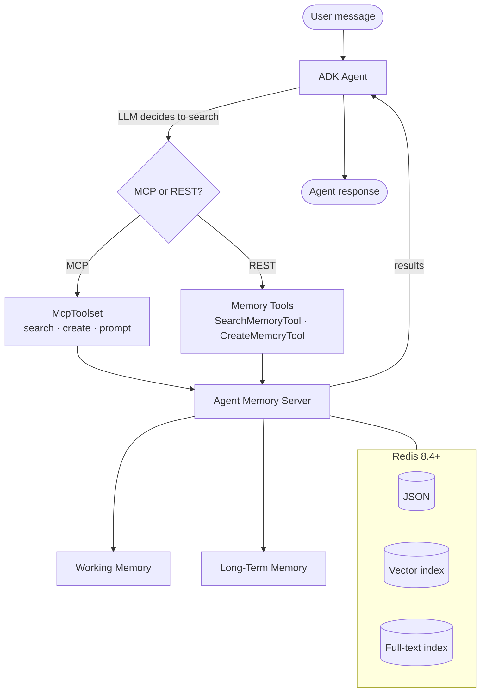

# Sessions + Memory with MCP + Tools

Use ADK's native `McpToolset` to connect your agent to the Agent Memory Server's MCP endpoint, or use the REST-based memory tools directly. The LLM decides when to search, create, update, or delete memories.

## Quick Reference

| Feature | Details |
|---------|---------|
| **Protocol** | MCP (via SSE or Streamable HTTP) or REST-based ADK tools |
| **Control** | LLM-driven: the agent chooses when to remember and recall |
| **Session storage** | Agent Memory Server working memory |
| **Long-term memory** | Agent Memory Server with vector + full-text indexes |
| **Language support** | MCP works with Python, TypeScript, and any MCP-compatible client |

## How It Works



Unlike the [services approach](sessions.md), where the framework handles memory automatically, here the LLM explicitly calls memory tools during reasoning. This gives you fine-grained control over what gets stored and retrieved.

## Option 1: MCP Tools

Connect to the Agent Memory Server's MCP endpoint using ADK's `McpToolset`. This is the recommended approach for multi-language support and when the same memory server is shared across agents.

```python
from google.adk import Agent
from google.adk.tools.mcp_tool import McpToolset
from google.adk.tools.mcp_tool.mcp_session_manager import SseConnectionParams

memory_tools = McpToolset(
    connection_params=SseConnectionParams(url="http://localhost:9000/sse"),
    tool_filter=[
        "search_long_term_memory",
        "create_long_term_memories",
        "memory_prompt",
    ],
)

agent = Agent(
    model="gemini-2.5-flash",
    name="my_agent",
    tools=[memory_tools],
    instruction="Search memory before answering. Store important facts.",
)
```

### Available MCP Tools

| Tool | Description |
|------|-------------|
| `search_long_term_memory` | Semantic, keyword, or hybrid search across memories |
| `create_long_term_memories` | Store new memories with topics, types, and metadata |
| `get_long_term_memory` | Retrieve a specific memory by ID |
| `edit_long_term_memory` | Update an existing memory |
| `delete_long_term_memories` | Remove memories by ID |
| `memory_prompt` | Enrich a prompt with relevant memories |
| `set_working_memory` | Write to the current session's working memory |

## Option 2: REST-Based Tools

Use the Python memory tool classes for direct REST access. No MCP server needed; the tools call the Agent Memory Server REST API.

```python
from google.adk import Agent

from adk_redis import (
    SearchMemoryTool,
    CreateMemoryTool,
    UpdateMemoryTool,
    DeleteMemoryTool,
    MemoryPromptTool,
    MemoryToolConfig,
)

config = MemoryToolConfig(
    api_base_url="http://localhost:8000",
    default_namespace="my_app",
    recency_boost=True,
)

agent = Agent(
    model="gemini-2.0-flash",
    name="my_agent",
    tools=[
        SearchMemoryTool(config=config),
        CreateMemoryTool(config=config),
        UpdateMemoryTool(config=config),
        DeleteMemoryTool(config=config),
        MemoryPromptTool(config=config),
    ],
)
```

### Available REST Tools

| Tool | Description |
|------|-------------|
| `SearchMemoryTool` | Semantic search with optional recency boost |
| `CreateMemoryTool` | Store a new memory (semantic, episodic, or message) |
| `GetMemoryTool` | Retrieve a memory by ID |
| `UpdateMemoryTool` | Update content, topics, or metadata |
| `DeleteMemoryTool` | Remove memories by ID |
| `MemoryPromptTool` | Enrich a system prompt with relevant memories |

## MCP vs REST Decision

| | MCP | REST Tools |
|---|---|---|
| **Multi-language** | Yes (Python, TypeScript, any MCP client) | Python only |
| **Shared server** | Yes, multiple agents connect to one MCP endpoint | Each agent connects directly to REST API |
| **Extra service** | Requires MCP server running | No extra service (direct HTTP) |
| **Tool filtering** | `tool_filter` on `McpToolset` | Choose which tool classes to instantiate |

## Configuration (REST Tools)

| Option | Default | Description |
|--------|---------|-------------|
| `api_base_url` | `http://localhost:8000` | Agent Memory Server URL |
| `timeout` | `30` | HTTP timeout in seconds |
| `default_namespace` | `default` | Namespace for memory isolation |
| `search_top_k` | `10` | Default max search results |
| `recency_boost` | `True` | Bias scoring toward newer memories |
| `distance_threshold` | `None` | Max vector distance for search results |
| `deduplicate` | `True` | Deduplicate when creating memories |

Launch with the [ADK web UI](https://google.github.io/adk-docs/runtime/) for interactive testing:

```bash
adk web .
```

## Next Steps

- [Sessions + Memory services](sessions.md) for the framework-managed alternative.
- [Fitness coach example](https://github.com/redis-developer/adk-redis/tree/main/examples/fitness_coach_mcp) for a working MCP-based agent.
- [Search tools](search.md) for RedisVL-backed index search (separate from memory search).
- [ADK runtime options](https://google.github.io/adk-docs/runtime/) for `adk web`, `adk run`, and `adk api_server`.
