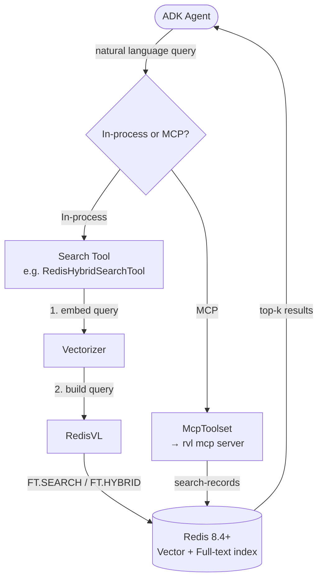

# RedisVL MCP + Search Tools

Search your own data with [RedisVL](https://docs.redisvl.com)-backed tools. Use in-process Python tools for fine-grained control, or connect to RedisVL's MCP server for language-agnostic, multi-agent access.

## Quick Reference

| Feature | Details |
|---------|---------|
| **Engine** | Redis Query Engine (built into Redis 8.4+) |
| **Library** | RedisVL (`redisvl>=0.18.2`) |
| **Search types** | Vector (semantic), hybrid (vector + BM25), range, text (BM25), SQL |
| **Vectorizers** | HuggingFace, OpenAI, Cohere, Ollama, and more via RedisVL |
| **MCP server** | `rvl mcp` exposes `search-records` and `upsert-records` tools |
| **Install** | `pip install 'adk-redis[search]'` (add `[sql]` for SQL search) |

## How It Works



## Option 1: In-Process Python Tools

Each tool subclasses `BaseTool` and wraps a RedisVL query type. Bind it to an existing index and pass it to your agent.

```python
from google.adk import Agent
from redisvl.index import SearchIndex
from redisvl.utils.vectorize import HFTextVectorizer

from adk_redis import RedisVectorSearchTool, RedisVectorQueryConfig

vectorizer = HFTextVectorizer(model="sentence-transformers/all-MiniLM-L6-v2")
index = SearchIndex.from_existing("products", redis_url="redis://localhost:6379")

tool = RedisVectorSearchTool(
    index=index,
    vectorizer=vectorizer,
    config=RedisVectorQueryConfig(
        vector_field_name="embedding",
        num_results=5,
    ),
    return_fields=["title", "price", "category"],
    name="search_products",
    description="Semantic search across the product catalog.",
)

agent = Agent(model="gemini-2.0-flash", tools=[tool])
```

### Available Tools

| Tool | Query type | Vectorizer | Use when |
|------|-----------|------------|----------|
| `RedisVectorSearchTool` | Semantic (cosine/IP/L2) | Yes | Finding semantically similar content |
| `RedisHybridSearchTool` | Vector + BM25 keyword | Yes | Best of both worlds: meaning and exact terms |
| `RedisRangeSearchTool` | Vector within distance | Yes | All content within a similarity radius |
| `RedisTextSearchTool` | BM25 full-text only | No | Keyword matching without embeddings |
| `RedisSQLSearchTool` | SQL `SELECT` | No | Structured queries with filters and aggregations |

### Hybrid Search

Combines vector similarity with BM25 keyword scoring. On Redis 8.4+ with `redisvl>=0.18.2`, uses the native `FT.HYBRID` command. Falls back to client-side aggregation on older versions.

```python
from adk_redis import RedisHybridSearchTool, RedisHybridQueryConfig

tool = RedisHybridSearchTool(
    index=index,
    vectorizer=vectorizer,
    config=RedisHybridQueryConfig(
        text_field_name="description",
        combination_method="LINEAR",
        linear_alpha=0.7,  # 70% text, 30% vector
        num_results=10,
    ),
)
```

### SQL Search

The LLM writes SQL `SELECT` statements; the tool translates them into `FT.SEARCH` or `FT.AGGREGATE` calls.

```python
from adk_redis import RedisSQLSearchTool

tool = RedisSQLSearchTool(index=index)
# LLM emits: SELECT title, price FROM products WHERE category = 'electronics'
```

Install with `pip install 'adk-redis[sql]'`.

## Option 2: RedisVL MCP Server

Connect to RedisVL's MCP server (`rvl mcp`) using ADK's `McpToolset`. The server exposes schema-aware tools per index.

```python
from google.adk import Agent
from google.adk.tools.mcp_tool import McpToolset
from google.adk.tools.mcp_tool.mcp_session_manager import StdioConnectionParams
from mcp import StdioServerParameters

agent = Agent(
    model="gemini-2.5-flash",
    name="redis_mcp_agent",
    tools=[
        McpToolset(
            connection_params=StdioConnectionParams(
                server_params=StdioServerParameters(
                    command="rvl",
                    args=["mcp", "--config", "mcp.yaml", "--read-only"],
                ),
                timeout=30,
            ),
            tool_filter=["search-records"],
        ),
    ],
)
```

For a remote server, swap `StdioConnectionParams` for `StreamableHTTPConnectionParams(url=..., headers={...})`.

Install with `pip install 'redisvl[mcp]>=0.18.2'`.

### MCP Tools

| Tool | Description |
|------|-------------|
| `search-records` | Schema-aware search (vector, fulltext, or hybrid, chosen at server start) |
| `upsert-records` | Write path. Suppress with `--read-only` on the server |

## In-Process vs MCP Decision

| | In-process tools | MCP (`rvl mcp`) |
|---|---|---|
| **Control** | Full config over query params, vectorizer | Schema-driven, server chooses search mode |
| **Multi-language** | Python only | Any MCP client (Python, TypeScript, Claude Desktop) |
| **Shared index** | Each agent connects directly | Multiple agents share one server |
| **Deployment** | No extra service | Requires running `rvl mcp` process |
| **Read-only guard** | Application-level | `--read-only` flag on server |

## Indexing

Before search tools can be used, documents must be indexed in Redis using RedisVL:

```python
from redisvl.index import SearchIndex

index = SearchIndex.from_yaml("schema.yaml")
index.create(overwrite=True)
index.load(documents)
```

Launch with the [ADK web UI](https://google.github.io/adk-docs/runtime/) for interactive testing:

```bash
adk web .
```

## Next Steps

- [Search tools how-to](../user_guide/how_to_guides/search_tools.md) for complete code samples.
- [RedisVL MCP search example](https://github.com/redis-developer/adk-redis/tree/main/examples/redisvl_mcp_search) for a working agent.
- [Sessions + Memory](sessions.md) for cross-session knowledge (different from index search).
- [ADK runtime options](https://google.github.io/adk-docs/runtime/) for `adk web`, `adk run`, and `adk api_server`.
