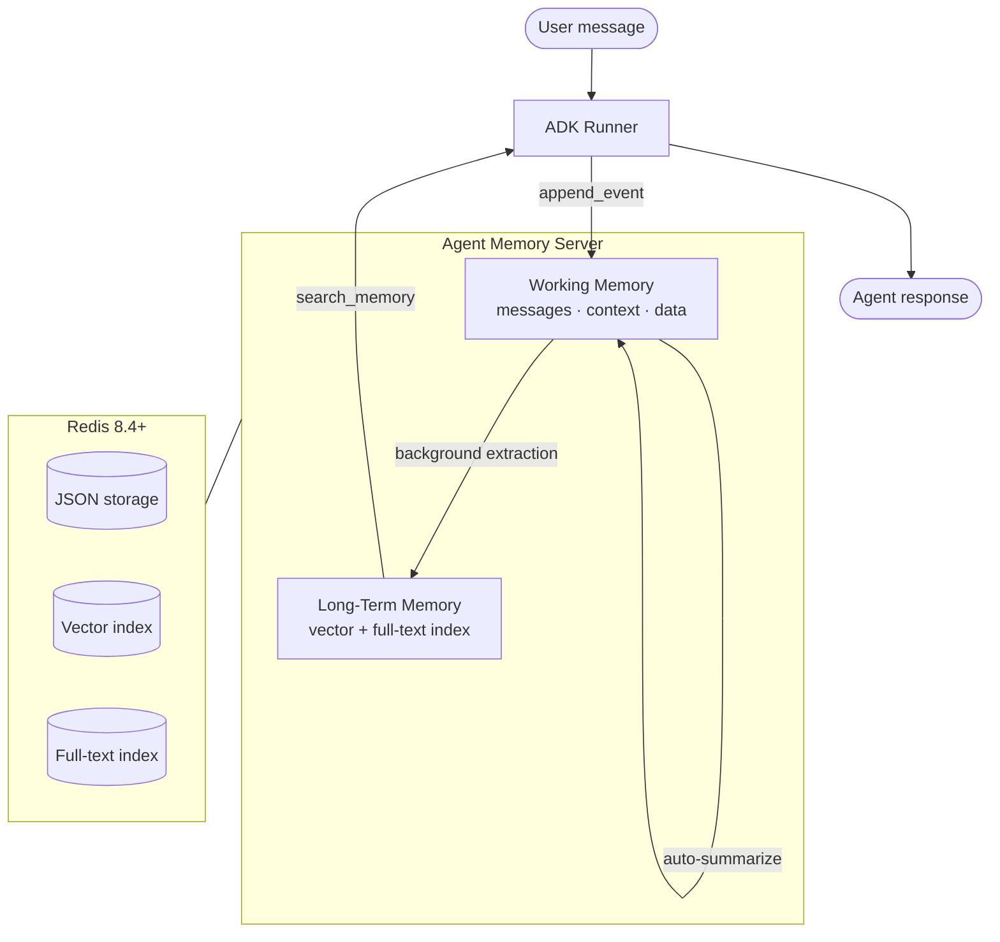
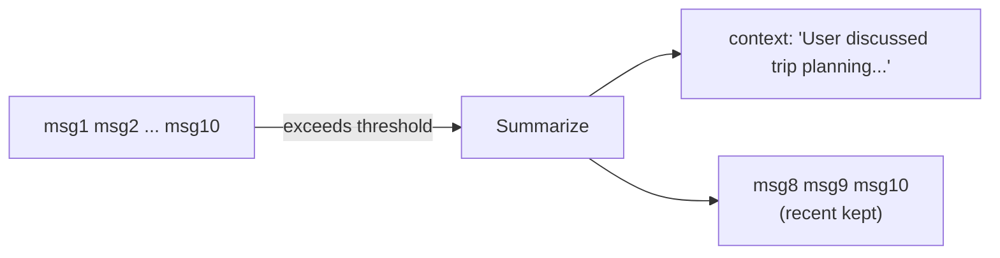

# Sessions + Memory with Services

Use `RedisWorkingMemorySessionService` and `RedisLongTermMemoryService` when you want the ADK `Runner` to manage sessions and memory automatically. Plug them in and let the framework handle the rest.

## Quick Reference

| Feature | Details |
|---------|---------|
| **Session storage** | Agent Memory Server working memory (Redis JSON) |
| **Long-term memory** | Agent Memory Server with vector + full-text indexes |
| **Auto-summarization** | Old messages are summarized when context window fills |
| **Memory extraction** | Background promotion of facts to long-term storage |
| **Search** | Semantic, keyword, and hybrid search across sessions |
| **Multi-process** | Safe for horizontal scaling; all state lives in Redis |

## How It Works



1. The ADK `Runner` calls `append_event()` after every turn, forwarding the message to the Agent Memory Server.
2. When the conversation exceeds `context_window_max` tokens, the server summarizes older messages and stores the summary in a `context` field.
3. A background task extracts structured memories (facts, preferences, events) and promotes them to long-term storage.
4. On future sessions, `search_memory()` retrieves relevant memories via hybrid search.

## Usage

```python
from google.adk.agents import Agent
from google.adk.runners import Runner

from adk_redis import (
    RedisLongTermMemoryService,
    RedisLongTermMemoryServiceConfig,
    RedisWorkingMemorySessionService,
    RedisWorkingMemorySessionServiceConfig,
)

session_service = RedisWorkingMemorySessionService(
    config=RedisWorkingMemorySessionServiceConfig(
        api_base_url="http://localhost:8000",
        default_namespace="my_app",
        model_name="gpt-4o",
        context_window_max=8000,
    ),
)

memory_service = RedisLongTermMemoryService(
    config=RedisLongTermMemoryServiceConfig(
        api_base_url="http://localhost:8000",
        default_namespace="my_app",
        recency_boost=True,
    ),
)

agent = Agent(
    model="gemini-2.0-flash",
    name="my_agent",
    instruction="You are a helpful assistant with memory.",
)

runner = Runner(
    agent=agent,
    session_service=session_service,
    memory_service=memory_service,
)
```

Launch with the [ADK web UI](https://google.github.io/adk-docs/runtime/) for interactive testing:

```bash
adk web .
```

## Configuration

### Session Service (`RedisWorkingMemorySessionServiceConfig`)

| Option | Default | Description |
|--------|---------|-------------|
| `api_base_url` | `http://localhost:8000` | Agent Memory Server URL |
| `timeout` | `30.0` | HTTP request timeout in seconds |
| `default_namespace` | `None` | Logical grouping for multi-tenant isolation |
| `model_name` | `None` | Model name used for context window sizing and summarization |
| `context_window_max` | `None` | Token limit that triggers auto-summarization |
| `extraction_strategy` | `discrete` | How memories are extracted (`discrete`, `summary`, `preferences`, `custom`) |
| `session_ttl_seconds` | `None` | Optional TTL; expired sessions are cleaned up by Redis |

### Memory Service (`RedisLongTermMemoryServiceConfig`)

| Option | Default | Description |
|--------|---------|-------------|
| `api_base_url` | `http://localhost:8000` | Agent Memory Server URL |
| `timeout` | `30.0` | HTTP request timeout in seconds |
| `default_namespace` | `None` | Namespace for memory isolation |
| `search_top_k` | `10` | Max results returned from `search_memory()` |
| `distance_threshold` | `None` | Max vector distance for search results (0.0-1.0) |
| `recency_boost` | `True` | Bias search scoring toward newer memories |
| `semantic_weight` | `0.8` | Weight for semantic similarity (0.0-1.0) |
| `recency_weight` | `0.2` | Weight for recency score (0.0-1.0) |
| `extraction_strategy` | `discrete` | How memories are extracted (`discrete`, `summary`, `preferences`, `custom`) |

## Automatic Summarization

When conversation messages exceed `context_window_max` tokens, the server:

1. Summarizes older messages into a compact paragraph.
2. Stores the summary in the `context` field of working memory.
3. Removes the summarized messages to free space.
4. Keeps recent messages intact.



## Memory Types

The server extracts three types of memories from conversations:

| Type | Description | Example |
|------|-------------|---------|
| **Semantic** | Facts, preferences, general knowledge | "User prefers window seats" |
| **Episodic** | Events with temporal context | "User visited Paris in March 2024" |
| **Message** | Conversation records (auto-generated) | Stored from working memory messages |

## Cross-Process Scaling

Because all state lives in the Agent Memory Server (backed by Redis), multiple processes can share sessions:

- **Horizontal scaling**: deploy multiple agent replicas behind a load balancer.
- **Seamless failover**: if one instance goes down, another picks up the session.
- **Background workers**: separate processes can read session state for analytics.

## Next Steps

- [Session service how-to](../user_guide/how_to_guides/session_service.md) for setup details.
- [Memory service how-to](../user_guide/how_to_guides/memory_service.md) for memory configuration.
- [Sessions + Memory MCP + Tools](memory.md) for the MCP-based alternative.
- [Fitness coach example](https://github.com/redis-developer/adk-redis/tree/main/examples/fitness_coach_mcp) for a working agent.
