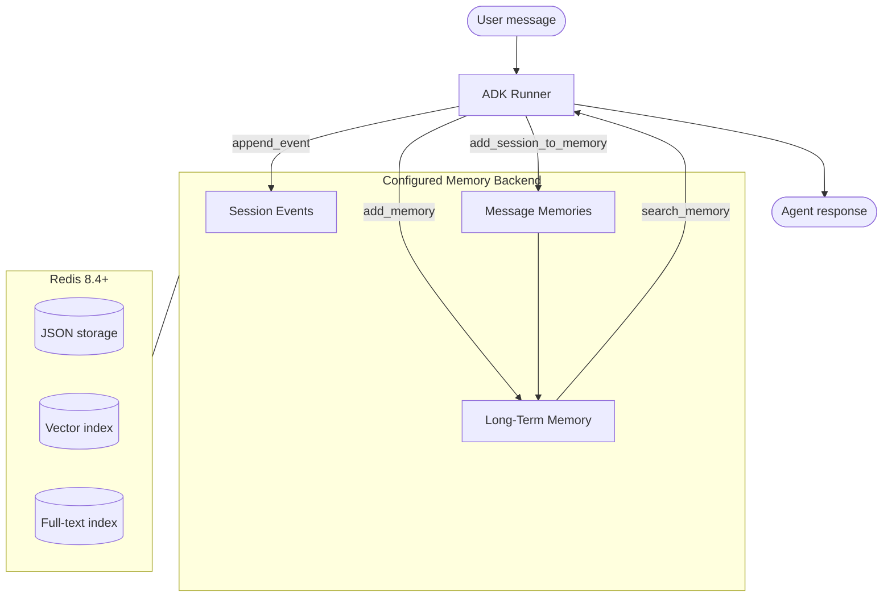

# Sessions + Memory with Services

Use `RedisWorkingMemorySessionService` and `RedisLongTermMemoryService` when you want the ADK `Runner` to manage sessions and memory automatically. Plug them in and let the framework handle the rest.

## Quick Reference

| Feature | Details |
|---------|---------|
| **Session storage** | Redis Agent Memory session events or Agent Memory Server working memory |
| **Long-term memory** | Redis Agent Memory records or Agent Memory Server long-term memory |
| **Direct memory writes** | `add_memory()` stores durable semantic or episodic facts |
| **Event memory writes** | `add_session_to_memory()` stores ADK events as `message` memories |
| **Search** | Backend long-term search across scoped records |
| **Multi-process** | Safe for horizontal scaling; all state lives in Redis |

## How It Works



1. The ADK `Runner` calls `append_event()` after every turn, forwarding the message to the configured memory backend.
2. ADK callbacks or API routes can call `add_session_to_memory()` to store session events as long-term `message` memories.
3. Agents and callbacks can call `add_memory()` or memory tools to store durable `semantic` or `episodic` records.
4. On future sessions, `search_memory()` retrieves relevant memories from the configured backend.

## Usage

```python
from google.adk.agents import Agent
from google.adk.runners import Runner

from adk_redis import (
    RedisLongTermMemoryService,
    RedisLongTermMemoryServiceConfig,
    RedisWorkingMemorySessionService,
    RedisWorkingMemorySessionServiceConfig,
)

session_service = RedisWorkingMemorySessionService(
    config=RedisWorkingMemorySessionServiceConfig(
        backend="redis-agent-memory",
        api_base_url="http://localhost:8000",
        api_key="...",
        store_id="...",
        default_namespace="my_app",
    ),
)

memory_service = RedisLongTermMemoryService(
    config=RedisLongTermMemoryServiceConfig(
        backend="redis-agent-memory",
        api_base_url="http://localhost:8000",
        api_key="...",
        store_id="...",
        default_namespace="my_app",
    ),
)

agent = Agent(
    model="gemini-2.0-flash",
    name="my_agent",
    instruction="You are a helpful assistant with memory.",
)

runner = Runner(
    agent=agent,
    session_service=session_service,
    memory_service=memory_service,
)
```

To use the open source self-hosted Agent Memory Server instead, set
`backend="opensource-agent-memory"` on both configs. Redis Agent Memory is the
default backend.

Launch with the [ADK web UI](https://google.github.io/adk-docs/runtime/) for interactive testing:

```bash
adk web .
```

## Configuration

### Session Service (`RedisWorkingMemorySessionServiceConfig`)

| Option | Default | Description |
|--------|---------|-------------|
| `backend` | `redis-agent-memory` | `redis-agent-memory` or `opensource-agent-memory` |
| `api_base_url` | `http://localhost:8000` | Memory backend URL |
| `api_key` | `None` | Redis Agent Memory API key |
| `store_id` | `None` | Redis Agent Memory store ID |
| `timeout` | `30.0` | HTTP request timeout in seconds |
| `default_namespace` | `None` | Logical grouping for multi-tenant isolation |

### Memory Service (`RedisLongTermMemoryServiceConfig`)

| Option | Default | Description |
|--------|---------|-------------|
| `backend` | `redis-agent-memory` | `redis-agent-memory` or `opensource-agent-memory` |
| `api_base_url` | `http://localhost:8000` | Memory backend URL |
| `api_key` | `None` | Redis Agent Memory API key |
| `store_id` | `None` | Redis Agent Memory store ID |
| `timeout` | `30.0` | HTTP request timeout in seconds |
| `default_namespace` | `None` | Namespace for memory isolation |
| `search_top_k` | `10` | Max results returned from `search_memory()` |
| `similarity_threshold` | `None` | Min similarity for search results (0.0-1.0) |
| `store_events_as_messages` | `True` | Store ADK events as `message` memories |

## Memory Types

Redis Agent Memory and Agent Memory Server support three memory types:

| Type | Description | Example |
|------|-------------|---------|
| **Semantic** | Facts, preferences, general knowledge | "User prefers window seats" |
| **Episodic** | Events with temporal context | "User visited Paris in March 2024" |
| **Message** | Conversation records | "user: I prefer window seats" |

## Cross-Process Scaling

Because all state lives in Redis, multiple processes can share sessions:

- **Horizontal scaling**: deploy multiple agent replicas behind a load balancer.
- **Seamless failover**: if one instance goes down, another picks up the session.
- **Background workers**: separate processes can read session state for analytics.

## Next Steps

- [Session service how-to](../user_guide/how_to_guides/session_service.md) for setup details.
- [Memory service how-to](../user_guide/how_to_guides/memory_service.md) for memory configuration.
- [Sessions + Memory MCP + Tools](memory.md) for the MCP-based alternative.
- [Fitness coach example](https://github.com/redis-developer/adk-redis/tree/main/examples/fitness_coach_mcp) for a working agent.
