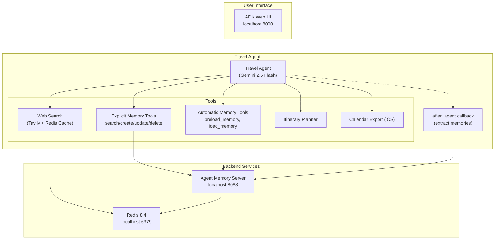

# Travel Agent Memory - Architecture

## Overview



## Components

| Component | Port | Description |
|-----------|------|-------------|
| **ADK Web UI** | 8000 | Chat interface for interacting with the agent |
| **Travel Agent** | - | LLM-powered agent (Gemini 2.5 Flash) |
| **Agent Memory Server** | 8088 | Long-term memory storage and retrieval |
| **Redis 8.4** | 6379 | Vector store, cache, and data persistence |

## Data Flow

1. **User sends message** → ADK Web UI → Travel Agent
2. **Automatic memory tools** (`preload_memory`, `load_memory`) load relevant user context
3. **Agent processes** using tools as needed:
   - Explicit memory tools → Agent Memory Server → Redis
   - Web search → Tavily API (cached in Redis)
   - Itinerary/Calendar → Local processing
4. **Agent responds** to user
5. **after_agent callback** extracts and stores new memories to Agent Memory Server

## Memory Architecture

```
┌─────────────────────────────────────────────────────┐
│                   Two-Tier Memory                    │
├─────────────────────────────────────────────────────┤
│  Working Memory (Session)                           │
│  └─ Current conversation context                    │
├─────────────────────────────────────────────────────┤
│  Long-Term Memory (Agent Memory Server)             │
│  └─ User preferences, past trips, stored facts     │
│  └─ Semantic search via Redis vector store         │
└─────────────────────────────────────────────────────┘
```

## Tools Summary

| Tool | Type | Purpose |
|------|------|---------|
| `search_memory` | Explicit (adk-redis) | Find stored preferences |
| `create_memory` | Explicit (adk-redis) | Store new preferences |
| `update_memory` | Explicit (adk-redis) | Modify existing preferences |
| `delete_memory` | Explicit (adk-redis) | Remove preferences |
| `preload_memory` | Automatic (ADK built-in) | Enrich prompts with relevant memories |
| `load_memory` | Automatic (ADK built-in) | Load specific memories on demand |
| `web_search` | Optional | Real-time travel info (Tavily) |
| `plan_itinerary` | Built-in | Create multi-day trip plans |
| `export_to_calendar` | Built-in | Generate ICS calendar files |

